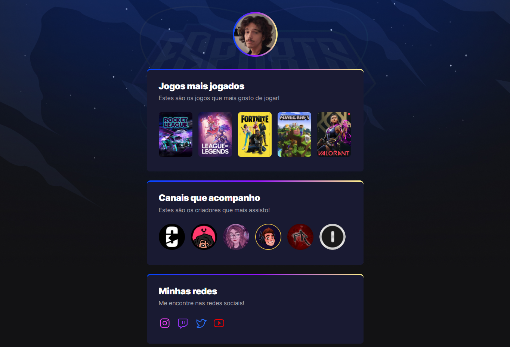

<h1 align="center">GamersTree</h1>

Mostre informações sobre as suas coisas favoritas e conecte-se com outros usuários

<a href="#projeto">Projeto</a>&nbsp;&nbsp;&nbsp;|&nbsp;&nbsp;
<a href="#tecnologias">Tecnologias</a>&nbsp;&nbsp;&nbsp;|&nbsp;&nbsp;
<a href="#contato">Contato</a>

[Link para acesso](https://maiacoding.github.io/GamersTree/)

## Projeto
O projeto GamersTree foi feito para reunir diversas informações sobre suas coisas favoritas, num projeto prático como um LinkTree, mas mais com a sua cara!
Desenvolvido durante o evento NLW Esports, na trilha Explorer

## Tecnologias

- HTML
- CSS
- JavaScript
- Git
- Github
  
## Contato

maia.zip@hotmail.com

