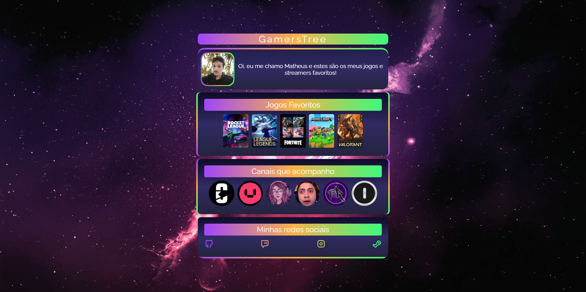
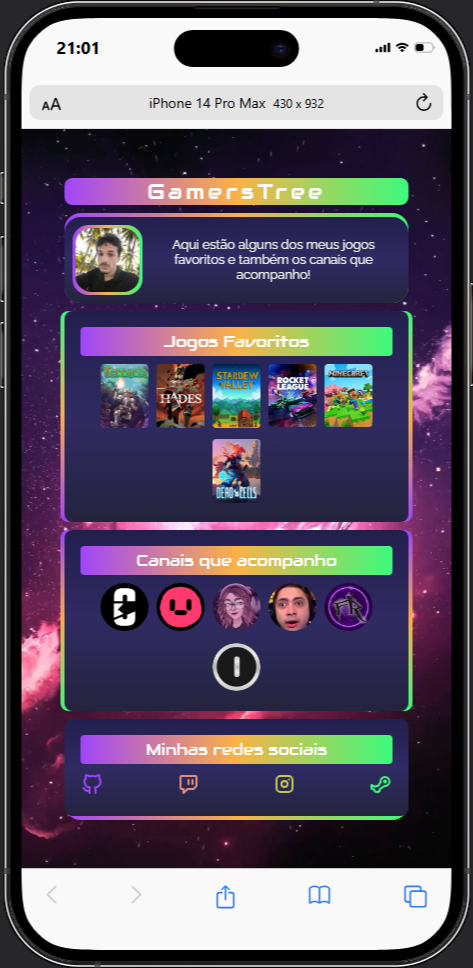

<h1 align="center">GamersTree</h1>

Mostre informações sobre as suas coisas favoritas e conecte-se com outros usuários

<a href="#projeto">Projeto</a>&nbsp;&nbsp;&nbsp;|&nbsp;&nbsp;
<a href="#tecnologias">Tecnologias</a>&nbsp;&nbsp;&nbsp;|&nbsp;&nbsp;
<a href="#contato">Contato</a>

[Link para acesso](https://maiazip.github.io/GamersTree/)

Preview Desktop

Preview Mobile

## Projeto
O projeto GamersTree é um protótipo de um mini linktree onde você pode adicionar informações sobre os jogos que você mais gosta e os canais de streamers que mais acompanha, a princípio somente em uma ideia porém podendo ter implementações em bancos de dados, permitindo você interagir e modificar as informações como desejar

## Tecnologias

- HTML
- CSS
- Git
- Github
  
## Contato

maia.zip@hotmail.com

